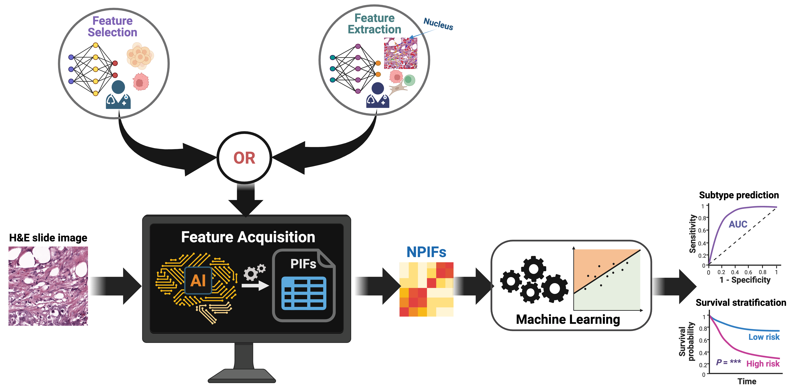

# EXPAND (EXplainable Pathologist Aligned Nuclear Discriminator)  

**Note:** This manuscript is currently under journal submission.  

**Citation (preprint forthcoming):**  
R. K. Barman, S. R. Dhruba, D. T. Hoang, E. D. Shulman, E. M. Campagnolo, A. T. Wang, S. A. Harmon, T. C. Hu, A. Papanicolau-Sengos, M. P. Nasrallah, K. D. Aldape, E. Ruppin.  
*"Pathologist-interpretable breast cancer subtyping and stratification from AI-inferred nuclear features"*, 2025.  
[Preprint link (coming soon)]()  

---

## Overview  

**EXPAND** is an open-source, interpretable AI pipeline designed to predict **breast cancer (BC) subtypes** and **patient survival risk** directly from H&E-stained whole-slide images (WSIs).  

While many deep learning models achieve strong accuracy, they often lack interpretability and do not reflect how pathologists evaluate morphology. EXPAND bridges this gap by focusing on a **compact set of biologically meaningful nuclear features**, making the pipeline intuitive, reproducible, and clinically relevant.  

  
<p align="center"><sup><i>
Figure: The full pipeline for EXPAND
</i></sup></p> 

---

## Why EXPAND?  

- **Transparent:** Uses 12 Nuclear Pathologist-Interpretable Features (NPIFs) derived from nuclei segmented with open-source tools.  
- **Robust:** Achieves predictive performance comparable to or better than black-box DL models using logistic regression with cross-validation.  
- **Generalizable:** Validated on CPTAC-BRCA and POST-NAT-BRCA cohorts in addition to TCGA.  
- **Scalable:** Requires only standard H&E slides and Hover-Net segmentation, making it deployable across cancer types and settings.  
- **Prognostic:** NPIFs independently predict survival outcomes (OS, PFS), enabling clinically interpretable risk stratification.  

---

## Key Features  

1. **12 NPIFs** – compact, biologically interpretable nuclear features (area, perimeter, eccentricity, etc.) aligned with pathologist workflows.  
2. **Subtype prediction** – HER2+, HR+, and TNBC classifiers trained with logistic regression.  
3. **External validation** – tested on CPTAC-BRCA and POST-NAT-BRCA datasets.  
4. **Survival modeling** – multivariate Cox regression models per subtype with Kaplan–Meier analysis for OS and PFS.
5. **Workflow Example** – WSI Tiling through NPIF Computation  

---

## Availability  

- All **source codes** are included in this repository.  
- A **short user guide** is provided below for quick setup. A full, step-by-step pipeline walkthrough is available in the detailed **User Guide (Word file)**.  
- The ML predictors were developed on **macOS (Python)** and tested on **Linux (HPC environment)**. Scripts can be run interactively in a Python IDE or from the command line:  
  ```bash
  python script_name.py
  ```  
- Please make sure to update the **working directory** and adjust all **file/folder paths** in each script to match your environment before running. 

---

## Dependencies  

Developed with **Python ≥ 3.10**. Core dependencies:  

```text
numpy >= 1.24.4
pandas >= 2.0.3
matplotlib >= 3.7.2
seaborn >= 0.13.2
scikit-learn >= 1.3.0
joblib >= 1.3.0 
opencv-python >= 4.10.0
torch >= 1.12.1
torchvision >= 0.13
Pillow >= 9.2.0
openslide-python >= 1.3.1
tqdm >= 4.65.0
pickle >= 4.0
lifelines >= 0.28.0
```

To install requirements:  
```bash
pip install -r requirements.txt
```  
---
# EXPAND Pipeline Overview  

This repository contains the complete **EXPAND pipeline** for **tile generation, nuclear segmentation, NPIF computation, subtype prediction, external validation, and survival analysis**. The steps are organized sequentially so users can reproduce the workflow end-to-end.  

---

## 1. Tile Generation (TCGA-BRCA) 
 
- **Scripts:**  
  - `1_01_get_tiles_from_slide.py`  
  - `1_11_jobs_to_get_tiles.py`  
- **Task:** Generate 512×512 tiles from H&E WSIs at 20× magnification.  

---

## 2. Tile-level Nucleus Segmentation with Hover-Net (TCGA-BRCA)  
- **Scripts:**  
  - `2_01_22_ExtractMorphologicalFeaturesFromHnE.py`  
  - `2_01_100_01_JobSubmissionCode.py`  
- **Task:** Run Hover-Net to segment and classify nuclei per tile.  

---

## 3. TCGA-BRCA: Morphology Computation  
- **Scripts:**  
  - `2_02_03_MorphologyCalculation_All_Slides.py`  
  - `2_02_13_Job_Submission_MorphologyCalculation_All_Slides.py`  
- **Task:** Compute per-nucleus morphology (area, perimeter, axis length, eccentricity, circularity).  

---

## 4. NPIF Calculation (TCGA-BRCA)  
- **Scripts:**  
  - `2_03_01_01_NPIFs_Calculation_HoverNet_V0.py` (all tiles)  
  - `2_03_01_01_NPIFs_Calculation_HoverNet_V1.py` (top 25% cancer-enriched tiles)  
- **Task:** Compute 12 NPIFs per slide from Hover-Net outputs.  

---

## 5. Mapping NPIFs to BRCA Biomarker Status  
- **Scripts:**  
  - `3_01_01_02_Mapped_Original_Value_Hovernet_NPIFs_to_BRCA_Subtypes.py` (all tiles)  
  - `3_01_01_06_...Top25Q.py` (top 25% tiles)  
- **Task:** Merge NPIFs with HER2, ER, PR metadata.  

---

## 6. BRCA Subtype Prediction Using NPIFs  
- **Scripts:**  
  - `4_01_04_103_04_101_...All_Tiles_Using_Lasso.py`  
  - `4_01_04_103_04_103_...Top25Q.py`  
- **Task:** Train logistic regression classifiers (L1 penalty) for HER2+, HR+, TNBC.  

---

## 7. CPTAC-BRCA Pipeline  
- **Segmentation:** `2_01_22_02_Test_CPTAC_Dataset_ExtractMorphologicalFeaturesFromHnE.py`  
- **Morphology:** `2_02_03_02_CPTAC_MorphologyCalculation_All_Slides.py`  
- **NPIFs:** `2_03_02_05_CPTAC_BRCA_NPIFs_Calculation_HoverNetPrediction_Filtered_Tiles_Top25Q.py`  
- **Mapping:** `3_01_01_07_CPTAC_Mapped_Original_Value...Top25Q.py`  
- **External Prediction:** `6_01_04_103_04_103_CPTAC_Prediction_Using_...Top25Q.py`  

---

## 8. POST-NAT-BRCA Pipeline (equivalent steps)  
- **Segmentation:** `2_01_22_02_Test_POST_NAT_Dataset_ExtractMorphologicalFeaturesFromHnE.py`  
- **Morphology:** `2_02_03_02_POST_NAT_MorphologyCalculation_All_Slides.py`  
- **NPIFs:** `2_03_02_05_POST_NAT_BRCA_NPIFs_Calculation_HoverNetPrediction_Filtered_Tiles_Top25Q.py`  
- **Mapping:** `3_01_01_07_POST_NAT_Mapped_Original_Value...Top25Q.py`  
- **Subtype Prediction:** `6_01_04_103_04_103_Lasso_POST_NAT_Prediction...Top25Q.py`  

---

## 9. Survival Analysis with EXPAND Features  
- **Mapping scripts:**  
  - `5_01_01_mapped_hovernet_npifs_to_tcga_survival.py`  
  - `5_01_02_mapped_pathai_hifs_to_tcga_survival.py`  
  - `5_01_03_mapped_pathai_nuhifs_to_tcga_survival.py`  
  - `5_01_04_mapped_pathai_pifs_to_tcga_survival.py`  
- **Model scripts:**  
  - `6_01_01_all_npifs_OS_analysis_with_age_cv.py`  
  - `6_01_02_01_all_hifs_OS_analysis...py`  
  - `6_01_03_01_all_nuhifs_OS_analysis...py`  
  - `6_01_04_01_all_pifs_OS_analysis...py`  

---

## 10. Subtype Prediction from PathAI-derived Features  
- **Scripts:**  
  - `1_01_01_mapped_tcga_biomarker_status_to_original_hifs_with_comments.py`  
  - `2_01_01_PathAI_Metadata_Original_nuHIFs_And_TCGA_BiomarkerStatus.py`  
  - `3_01_01_PathAI_Metadata_Original_PIFs_And_TCGA_BiomarkerStatus.py`  
  - Corresponding subtype prediction scripts.  

---

## 11. Direct Feature Extraction (ResNet50)  
- **Scripts:**  
  - `3_01_01_02_TCGA_BRCASubtypes_to_DirectHnE_Features_Resnet50.py`  
  - `3_01_04_103_04_103_02_BRCA_Clinical_Subtype_Prediction_Using_All_Direct_Features.py`  
- **Task:** Extract slide-level embeddings with ResNet50 and train subtype classifiers.    

---

## Reproducing Results  

All results described in the manuscript can be reproduced using the scripts provided in this repository. Follow the step-by-step workflow in the **User Guide** to replicate subtype classification, external validation, and survival analyses.  

---

## Contact  

- **Ranjan Kumar Barman** – ranjan.barman@nih.gov  
- **Saugato Rahman Dhruba** – saugatorahman.dhruba@nih.gov  

Cancer Data Science Lab, NCI, NIH  
